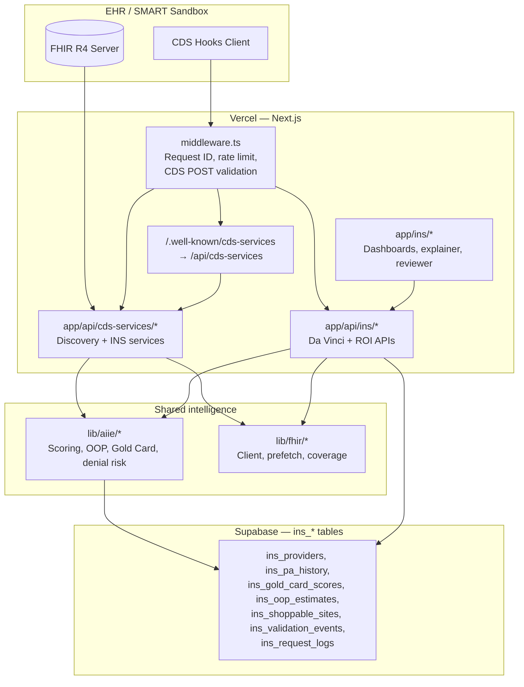

# ARKA-INS — architecture map

Investor and regulator-facing map of the unified ARKA platform and where ARKA-INS (coverage, cost, PA, ROI) lives in the repository.

## Unified platform (logical view)



ASCII (alternate):

```
[EHR FHIR] <----SMART/OAuth----> [Next.js API: CDS + INS]
       |                              |
       v                              v
 [CDS Hooks POST] ------------> [AIIE + lib/fhir] ----> [Supabase ins_*]
```

## Scope boundaries (monorepo)

| Area | Path prefix | Notes |
|------|-------------|--------|
| ARKA-INS UI | `app/ins/`, `components/ins/` | FDA banner via shared compliance providers |
| ARKA-INS API | `app/api/ins/`, `app/api/cds-services/` | CDS discovery + INS hook services |
| Shared engine | `lib/aiie/`, `lib/fhir/`, `lib/davinci/`, `lib/cards/` | Single AIIE scoring import; INS-specific helpers as siblings |
| Shared compliance | `components/shared/compliance/` | FDA Non-Device CDS, evidence modal |
| CLIN / ED | `app/clin/`, `app/ed/`, … | Isolated per `.cursorrules`; not modified by INS work |

## Technical deliverables → files

| Deliverable | Primary paths |
|-------------|----------------|
| CDS Hooks discovery (unified CLIN + INS) | `app/api/cds-services/route.ts`, `vercel.json` (rewrite `/.well-known/cds-services`) |
| CDS `order-select` — coverage, Gold Card, OOP, CRD cards | `app/api/cds-services/arka-ins-coverage/route.ts`, `lib/davinci/crd.ts`, `lib/cards/*.ts` |
| CDS `order-sign` — final check | `app/api/cds-services/arka-ins-final-check/route.ts` |
| CDS `appointment-book` — site optimizer | `app/api/cds-services/arka-ins-appointment/route.ts`, `lib/cards/alternative-site-card.ts` |
| Da Vinci PAS submit / status | `app/api/ins/pas/submit/route.ts`, `app/api/ins/pas/status/[paId]/route.ts`, `lib/davinci/pas.ts` |
| Da Vinci DTR questionnaire + submit | `app/api/ins/dtr/questionnaire/[orderId]/route.ts`, `app/api/ins/dtr/submit/route.ts`, `lib/davinci/dtr.ts` |
| Gold Card API + dashboard | `app/api/ins/gold-card/eligibility/route.ts`, `lib/aiie/gold-card.ts`, `app/ins/provider/gold-card/`, `components/ins/provider/GoldCardDashboardClient.tsx` |
| OOP estimate + GFE | `app/api/ins/oop/estimate/route.ts`, `lib/aiie/oop-estimator.ts`, `lib/ins/gfe.ts` |
| Shoppable sites API | `app/api/ins/oop/shoppable/route.ts`, `lib/ins/shoppable-helpers.ts`, `lib/ins/us-zip-centroids.ts` |
| ROI / validation metrics API | `app/api/ins/validation/metrics/route.ts`, `app/api/ins/validation/drilldown/route.ts`, `lib/validation/metrics.ts` |
| Reviewer queue (RBM) | `app/api/ins/reviewer/*/route.ts`, `lib/ins/reviewer-queue.ts`, `lib/ins/reviewer-types.ts`, `app/ins/reviewer/` |
| Middleware: request ID, rate limit, CDS validation | `middleware.ts`, `lib/middleware/ins-rate-limit.ts`, `lib/validation/cds-hooks-request.ts` |
| API timing / p95 storage | `lib/server/with-ins-api-logging.ts`, `lib/server/ins-request-log.ts`, `supabase/migrations/012_ins_request_logs.sql` |
| CDS + INS response validation (tests) | `lib/validation/cds-hooks-response.ts`, `__tests__/rural/raas-engine.test.ts` (rural); sandbox `scripts/test-cds-sandbox.ts` |

## Behavioral / UX deliverables → files

| Deliverable | Primary paths |
|-------------|----------------|
| Patient-facing explainer | `app/ins/patient/explainer/[orderId]/`, `components/ins/patient/PatientExplainerClient.tsx` |
| ROI dashboard UI | `app/ins/dashboard/roi/`, `components/ins/roi/RoiDashboardClient.tsx`, `components/ins/roi/MethodologyModal.tsx` |
| Reviewer dashboard | `app/ins/reviewer/`, `components/ins/reviewer/*.tsx` |
| Demo mode watermark | `components/ins/DemoModeWatermark.tsx`, `lib/demo/demo-mode.ts` |
| FDA banner + evidence entry | `components/shared/compliance/FDANonDeviceBanner.tsx`, `components/shared/compliance/evidence-modal-context.tsx`, `components/ins/AIIEEvidenceModal.tsx` |
| Investor / offline demo metrics | `lib/demo/offline-demo-metrics.ts`, `lib/demo/offline-gold-portfolio.ts` |

## Validation metrics (KPIs) → implementation

| Metric theme | Engine | API |
|--------------|--------|-----|
| Burden, minutes saved, payer SLA, cost avoidance | `lib/validation/metrics.ts` | `app/api/ins/validation/metrics/route.ts` |
| Drill-down / audit rows | `lib/validation/metrics.ts` | `app/api/ins/validation/drilldown/route.ts` |
| Event sourcing | `ins_validation_events` (migrations `005_*`, `009_*`, etc.) | Writes from CDS routes, PAS, reviewer action |

## OOP & transparency features → implementation

| Feature | Path |
|---------|------|
| OOP estimation core | `lib/aiie/oop-estimator.ts`, `lib/aiie/coverage-financials.ts`, `lib/aiie/cpt-pricing.ts` |
| GFE block for uninsured / self-pay narrative | `lib/ins/gfe.ts` |
| Shoppable comparator data | `lib/ins/shoppable-helpers.ts`, `supabase/migrations/008_ins_shoppable_negotiated_rate.sql`, seed `scripts/seed-shoppable-sites.ts` |
| Alternative site / savings cards | `lib/cards/alternative-site-card.ts`, `lib/cards/oop-card.ts` |

## Regulatory & interoperability

| Topic | Path |
|-------|------|
| FDA Non-Device CDS copy on cards | `lib/cards/card-shared.ts`, `lib/davinci/crd.ts` |
| CMS-0057-F SLAs / denial narrative | `lib/davinci/pas.ts`, PAS responses in `lib/types/davinci.ts` |
| CDS Hooks types | `lib/types/cds-hooks.ts` |
| FHIR types | `lib/types/fhir.ts` |

## Related docs

- `docs/INS_SANDBOX_TESTING.md` — sandbox testing notes  
- `docs/INS_DEPLOYMENT.md` — Vercel + Supabase + partner registration  
- `docs/INS_GO_LIVE_CHECKLIST.md` — release gate
